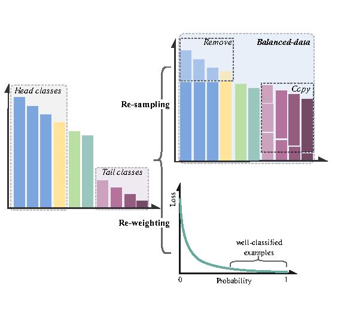

# LREBench: A low-resource relation extraction benchmark.

This repo is official implementation for the EMNLP2022 (Findings) paper *LREBench: [Towards Realistic Low-resource Relation Extraction: A Benchmark with Empirical Baseline Study](https://arxiv.org/pdf/2210.10678.pdf)*. This paper presents an empirical study to build relation extraction systems in low-resource settings. Based upon recent PLMs, three schemes are comprehensively investigated to evaluate the performance in low-resource settings: $(i)$ different types of prompt-based methods with few-shot labeled data;  $(ii)$ diverse balancing methods to address the long-tailed distribution issue; $(iii)$ data augmentation technologies and self-training to generate more labeled in-domain data.


## Contents

- [LREBench](#lrebench)
  - [Environment](#environment)
  - [Datasets](#datasets)
  - [Normal Prompt-based Tuning](#normal-prompt-based-tuning)
    - [1 Initialize Answer Words](#1-initialize-answer-words)
    - [2 Split Datasets](#2-split-datasets)
    - [3 Prompt-based Tuning](#3-prompt-based-tuning)
    - [4 Different prompts](#4-different-prompts)
  - [Balancing](#balancing)
    - [1 Re-sampling](#1-re-sampling)
    - [2 Re-weighting Loss](#2-re-weighting-loss)
  - [Data Augmentation](#data-augmentation)
    - [1 Prepare the environment](#1-prepare-the-environment)
    - [2 Try different DA methods](#2-try-different-da-methods)
  - [Self-training for Semi-supervised learning](#self-training-for-semi-supervised-learning)
  - [Standard Fine-tuning Baseline](#standard-fine-tuning-baseline)


## Environment

To install requirements:

```shell
>> conda create -n LREBench python=3.9
>> conda activate LREBench
>> pip install -r requirements.txt --extra-index-url https://download.pytorch.org/whl/cu113
```


## Datasets

We provide 8 benchmark datasets and prompts used in our experiments.

- [SemEval](https://github.com/zjunlp/KnowPrompt/tree/master/dataset/semeval)
- [TACREV](https://github.com/zjunlp/KnowPrompt/tree/master/dataset/tacrev)
- [Wiki80](https://github.com/thunlp/OpenNRE/blob/master/benchmark/download_wiki80.sh)
- [SciERC](http://nlp.cs.washington.edu/sciIE/)
- [ChemProt](https://github.com/ncbi-nlp/BLUE_Benchmark)
- [DialogRE](https://dataset.org/dialogre/)
- [DuIE2.0](https://www.luge.ai/#/luge/dataDetail?id=5)
- [CMeIE](https://tianchi.aliyun.com/dataset/dataDetail?dataId=95414)

All processed full-shot datasets can be [downloaded](https://drive.google.com/drive/folders/1OXxMr4SXUhehJx1XmDdrhJAppfo_ZNUh?usp=sharing) and need to be placed in the [*dataset*](dataset) folder.
The expected files of one dataset contains **rel2id.json**, **train.json** and **test.json**.


## Normal Prompt-based Tuning

<div align="center>

</div>

### 1 Initialize Answer Words

Use the command below to get answer words first.

```shell
>> python get_label_word.py --modelpath roberta-large --dataset semeval
```

The `{modelpath}_{dataset}.pt` will be saved in the *dataset* folder, and you need to assign the `modelpath` and `dataset` with names of the pre-trained language model and the dataset to be used before.

### 2 Split Datasets

We provide the sampling code for obtaining 8-shot ([sample_8shot.py](sample_8shot.py)) , 10% ([sample_10.py](sample_10.py)) datasets and the rest datasets used as unlabeled data for self-training. If there are classes with less than 8 instances, these classes are removed in training and testing sets when sampling 8-shot datasets and **new_test.json** and **new_rel2id.json** are obtained. 

```shell
>> python sample_8shot.py -h
    usage: sample_8shot.py [-h] --input_dir INPUT_DIR --output_dir OUTPUT_DIR

    optional arguments:
      -h, --help            show this help message and exit
      --input_dir INPUT_DIR, -i INPUT_DIR
                            The directory of the training file.
      --output_dir OUTPUT_DIR, -o OUTPUT_DIR
                            The directory of the sampled files.
>> python sample_10.py -h
    usage: sample_10.py [-h] --input_file INPUT_FILE --output_dir OUTPUT_DIR

    optional arguments:
      -h, --help            show this help message and exit
      --input_file INPUT_FILE, -i INPUT_FILE
                            The directory of the training file.
      --output_dir OUTPUT_DIR, -o OUTPUT_DIR
                            The directory of the sampled files.
```

For example:

```shell
>> python sample_8.py -i dataset/semeval -o dataset/semeval/8-shot
>> cd dataset/semeval
>> mkdir 8-1
>> cp 8-shot/new_rel2id.json 8-1/rel2id.json
>> cp 8-shot/new_test.json 8-1/test.json
>> cp 8-shot/train_8_1.json 8-1/train.json
>> cp 8-shot/unlabel_8_1.json 8-1/label.json
```


### 3 Prompt-based Tuning

All running scripts for each dataset are in the *scripts* folder. 
For example, train *KonwPrompt* on SemEval, CMeIE and ChemProt with the following commands:

```shell
>> bash scripts/semeval.sh  # RoBERTa-large
>> bash scripts/CMeIE.sh    # Chinese RoBERTa-large
>> bash scripts/ChemProt.sh # BioBERT-large
```


### 4 Different prompts


Simply add parameters to the scripts.

Template Prompt: `--use_template_words 0`

Schema Prompt: `--use_template_words 0 --use_schema_prompt True`

PTR: refer to [PTR](https://github.com/thunlp/PTR)


## Balancing

<div align="center>

</div>

### 1 Re-sampling

- Create the re-sampled training file based on the 10% training set by *resample.py*.
  
  ```shell
  >> python resample.py -h
      usage: resample.py [-h] --input_file INPUT_FILE --output_dir OUTPUT_DIR --rel_file REL_FILE
  
      optional arguments:
        -h, --help            show this help message and exit
        --input_file INPUT_FILE, -i INPUT_FILE
                              The path of the training file.
        --output_dir OUTPUT_DIR, -o OUTPUT_DIR
                              The directory of the sampled files.
        --rel_file REL_FILE, -r REL_FILE
                              the path of the relation file
  ```
  
  For example,
  
  ```shell
  >> mkdir dataset/semeval/10sa-1
  >> python resample.py -i dataset/semeval/10/train10per_1.json -r dataset/semeval/rel2id.json -o dataset/semeval/sa
  >> cd dataset/semeval
  >> cp rel2id.json test.json 10sa-1/
  >> cp sa/sa_1.json 10sa-1/train.json
  ```

### 2 Re-weighting Loss

Simply add the *useloss* parameter to script for choosing various re-weighting loss.

For exampe: `--useloss MultiFocalLoss`.
(chocies: MultiDSCLoss, MultiFocalLoss, GHMC_Loss, LDAMLoss)


## Data Augmentation

<div align="center>

</div>

### 1 Prepare the environment

```shell
>> pip install nlpaug nlpcda
```

Please follow the instructions from [nlpaug](https://github.com/makcedward/nlpaug#installation) and [nlpcda](https://github.com/425776024/nlpcda) for more information (Thanks a lot!).

### 2 Try different DA methods

We provide many data augmentation methods

- English (nlpaug): TF-IDF, contextual word embedding (BERT and RoBERTa), and WordNet' Synonym (-lan==en, -d).
- Chinese (nlpcda): Synonym (-lan==cn)
- All DA methods can be implemented on contexts, entities and both of them (--locations). 
- Generate augmented data
  ```shell
  >> python DA.py -h
      usage: DA2.py [-h] --input_file INPUT_FILE --output_dir OUTPUT_DIR --language {en,cn}
                    [--locations {sent1,sent2,sent3,ent1,ent2} [{sent1,sent2,sent3,ent1,ent2} ...]]
                    [--DAmethod {word2vec,TF-IDF,word_embedding_bert,word_embedding_roberta,random_swap,synonym}]
                    [--model_dir MODEL_DIR] [--model_name MODEL_NAME] [--create_num CREATE_NUM] [--change_rate CHANGE_RATE]
  
      optional arguments:
        -h, --help            show this help message and exit
        --input_file INPUT_FILE, -i INPUT_FILE
                              the training set file
        --output_dir OUTPUT_DIR, -o OUTPUT_DIR
                              The directory of the sampled files.
        --language {en,cn}, -lan {en,cn}
                              DA for English or Chinese
        --locations {sent1,sent2,sent3,ent1,ent2} [{sent1,sent2,sent3,ent1,ent2} ...], -l {sent1,sent2,sent3,ent1,ent2} [{sent1,sent2,sent3,ent1,ent2} ...]
                              List of positions that you want to manipulate
        --DAmethod {word2vec,TF-IDF,word_embedding_bert,word_embedding_roberta,random_swap,synonym}, -d {word2vec,TF-IDF,word_embedding_bert,word_embedding_roberta,random_swap,synonym}
                              Data augmentation method
        --model_dir MODEL_DIR, -m MODEL_DIR
                              the path of pretrained models used in DA methods
        --model_name MODEL_NAME, -mn MODEL_NAME
                              model from huggingface
        --create_num CREATE_NUM, -cn CREATE_NUM
                              The number of samples augmented from one instance.
        --change_rate CHANGE_RATE, -cr CHANGE_RATE
                              the changing rate of text
  ```

  Take context-level DA based on contextual word embedding on ChemProt for example:

  ```shell
  python DA.py \
      -i dataset/ChemProt/10/train10per_1.json \
      -o dataset/ChemProt/aug \
      -d word_embedding_bert \
      -mn dmis-lab/biobert-large-cased-v1.1 \
      -l sent1 sent2 sent3
  ```

- Delete repeated instances and get the final augmented data

  ```shell
  >> python merge_dataset.py -h
  usage: merge_dataset.py [-h] [--input_files INPUT_FILES [INPUT_FILES ...]] [--output_file OUTPUT_FILE]
  
  optional arguments:
    -h, --help            show this help message and exit
    --input_files INPUT_FILES [INPUT_FILES ...], -i INPUT_FILES [INPUT_FILES ...]
                          List of input files containing datasets to merge
    --output_file OUTPUT_FILE, -o OUTPUT_FILE
                          Output file containing merged dataset
  ```

  For example:

  ```bash
  python merge_dataset.py \
      -i dataset/ChemProt/train10per_1.json dataset/ChemProt/aug/aug.json \
      -o dataset/ChemProt/aug/merge.json
  ```

## Self-training for Semi-supervised learning

<div align="center>

</div>

- Train a teacher model on a few labeled data (8-shot or 10%)
- Place the unlabeled data **label.json** in the corresponding dataset folder.
- Assigning pseudo labels using the trained teacher model: add `--labeling True` to the script and obtain the pseudo-labeled dataset **label2.json**.
- Put the gold-labeled data and pseudo-labeled data together. For example:
  ```shell
  >> python self-train_combine.py -g dataset/semeval/10-1/train.json -p dataset/semeval/10-1/label2.json -la dataset/semeval/10la-1
  >> cd dataset/semeval
  >> cp rel2id.json test.json 10la-1/
  ```
- Train the final student model: add `--stutrain True` to the script


## Standard Fine-tuning Baseline
<div align="center>

</div> 
[Fine-tuning](Fine-tuning/)
